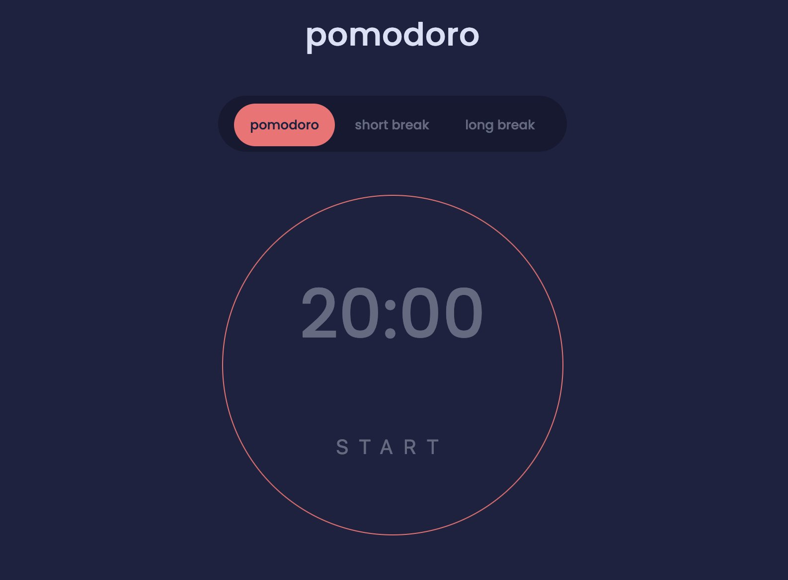

# pomodoro

A simple pomodoro timer to help you stay on task. Choose the length of time for your timer. Once time is up you will receive an alert letting you know that the chosen time period has elapsed.

For more information about the pomodoro technique, check out this article by [todoist](https://todoist.com/productivity-methods/pomodoro-technique)

## Table of contents

- [Overview](#overview)
  - [The challenge](#the-challenge)
  - [Screenshot](#screenshot)
  - [Links](#links)
- [My process](#my-process)
  - [Built with](#built-with)
  - [What I learned](#what-i-learned)
  - [Continued development](#continued-development)
  - [Useful resources](#useful-resources)
- [Author](#author)

## Overview

### The challenge

Users are able to:

- Choose between a 20 minute pomodoro, a 5 minute short break or a 30 minute long break.
- Receive an alert when time is up

### Screenshot

### Links

- Live Site URL: [Live Demo](https://alekzandriia.github.io/pomodoro)
- Solution URL: [Source Code](https://github.com/alekzandriia/pomodoro)

## My process

### Built with

- Semantic HTML5 markup
- CSS3
- Flexbox
- Google fonts
- JavaScript

### What I learned

How to style a set of custom radio buttons by hiding the default input and adding styles to the input labels instead.

How to use setInterval to execute functions repeatedly.

### Continued development

Allow the user to customize the timers.
Allow the user to change the colour scheme.
Add a sound and notification when the timer is up instead of a simple alert.

### Useful resources

Styling Checkbox Input
[Styling Custom Radio Buttons](https://www.youtube.com/watch?v=GDh9uToZkYg)
[MDN Set Interval](https://developer.mozilla.org/en-US/docs/Web/API/setInterval)

## Author

- Website - [Alekzandriia](https://www.alekz.dev)
- Twitter - [@alekzandriia](https://www.twitter.com/alekzandriia)
